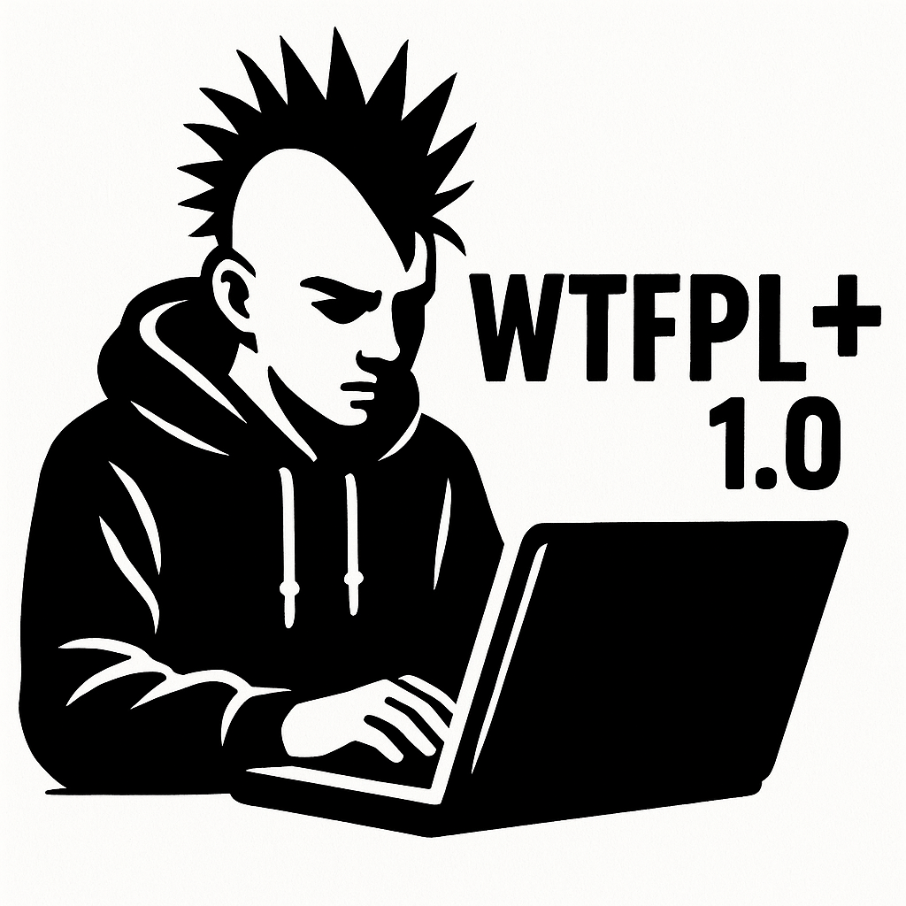

# Do What The Fuck You Want Public License Plus (WTFPL+)



**Version 1.0.0 – August 2025**

**Copyright © 2025 Norbert Heimsath**

**Licensed under: WTFPL+**

## Content

[TOC]


## Introduction

The **Do What The Fuck You Want Public License Plus** (WTFPL+) is an evolution of the famously short and permissive WTFPL.  
The original WTFPL essentially boiled down to: *"Do whatever the hell you want."*  
However, in some countries there have been cases where software authors were sued despite such permissive terms,  
often because their software allegedly caused **damage** or **did not function as expected**.

To address these situations, **Version 1.0.0** adds a clear and detailed **disclaimer**.  
This disclaimer explicitly states that the software is provided **without any warranty whatsoever**,  
and that the authors accept **no liability** for damages, data loss, or any other consequences.


## Background and Examples
The WTFPL+ was created in response to several real-world incidents where developers faced legal action despite using highly permissive licenses.  
Examples include:
- **2014:** A US-based open-source library maintainer was sued after a dependency of their software indirectly caused a system outage.
- **2021:** In Germany, a company attempted to hold the author of a free automation tool liable after an internal process built on it deleted critical data.
- **2023:** A French startup sought damages from a game developer after a modification script allegedly led to hardware failure.

These cases highlighted that even a “do whatever you want” license can still be **legally vulnerable** without an explicit liability disclaimer.  
The WTFPL+ closes this gap by adding a clear **"use at your own risk"** statement.


## Plain text Version

```text
                              WTFPL+
          DO WHAT THE FUCK YOU WANT TO PUBLIC LICENSE PLUS
                     Version 1, August 2025

Copyright (C) 2025 [Your Name or Organization]

Everyone is permitted to copy and distribute verbatim or modified
copies of this license document, and changing it is allowed as long
as the name is changed.

          DO WHAT THE FUCK YOU WANT TO PUBLIC LICENSE PLUS
   TERMS AND CONDITIONS FOR COPYING, DISTRIBUTION AND MODIFICATION

   0. You just DO WHAT THE FUCK YOU WANT TO!

                           DISCLAIMER
This software is provided "AS IS", without warranty of any kind,
express or implied, including but not limited to the warranties of
merchantability, fitness for a particular purpose and noninfringement.
In no event shall the authors be liable for any claim, damages or
other liability, whether in an action of contract, tort or otherwise,
arising from, out of or in connection with the software or the use or
other dealings in the software.

So in short:
                      DO WHATEVER YOU WANT,
                   BUT IF IT BREAKS SOMETHING,
               DON’T COME CRYING — OR SUING — TO ME.

```


## Version with protected spaces  (`U+00A0`)

```text
                               WTFPL+
          DO WHAT THE FUCK YOU WANT TO PUBLIC LICENSE PLUS
                     Version 1, August 2025

Copyright (C) 2025 [Your Name or Organization]

Everyone is permitted to copy and distribute verbatim or modified
copies of this license document, and changing it is allowed as long
as the name is changed.

          DO WHAT THE FUCK YOU WANT TO PUBLIC LICENSE PLUS
   TERMS AND CONDITIONS FOR COPYING, DISTRIBUTION AND MODIFICATION

   0. You just DO WHAT THE FUCK YOU WANT TO!

                           DISCLAIMER
This software is provided "AS IS", without warranty of any kind,
express or implied, including but not limited to the warranties of
merchantability, fitness for a particular purpose and noninfringement.
In no event shall the authors be liable for any claim, damages or
other liability, whether in an action of contract, tort or otherwise,
arising from, out of or in connection with the software or the use or
other dealings in the software.

So in short:
                      DO WHATEVER YOU WANT,
                   BUT IF IT BREAKS SOMETHING,
               DON’T COME CRYING — OR SUING — TO ME.

```

 

## Links

### Github Projekt

https://github.com/NorHei/WBCE_Plus

### Homepage

….


## Artwork

inside of the **/img**  of the Github Project page you can find several Artworks that can be used. They are all released under the same License as the License ;-)
Here are just some examples:


## Contact 

This is a purely private, non-commercial project.
 If you would like to get in touch, you can reach me via GitHub:
https://github.com/NorHei/WTFPL_Plus
Please open an Issue in this repository or send me a direct message (if available).


## Data Protection, Privacy Policy &  (no) Cookie Statement

This website does not use cookies, does not track you, and does not log personal data.
Enjoy your visit without pop-ups or consent banners.


